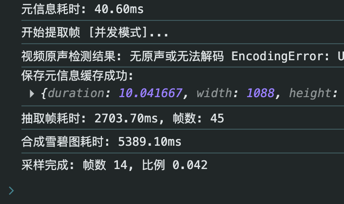
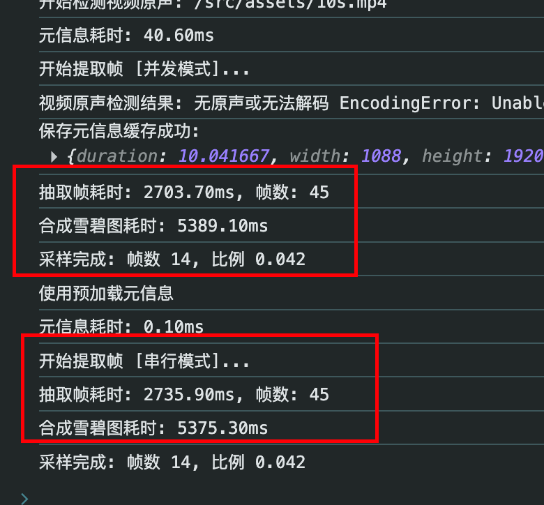
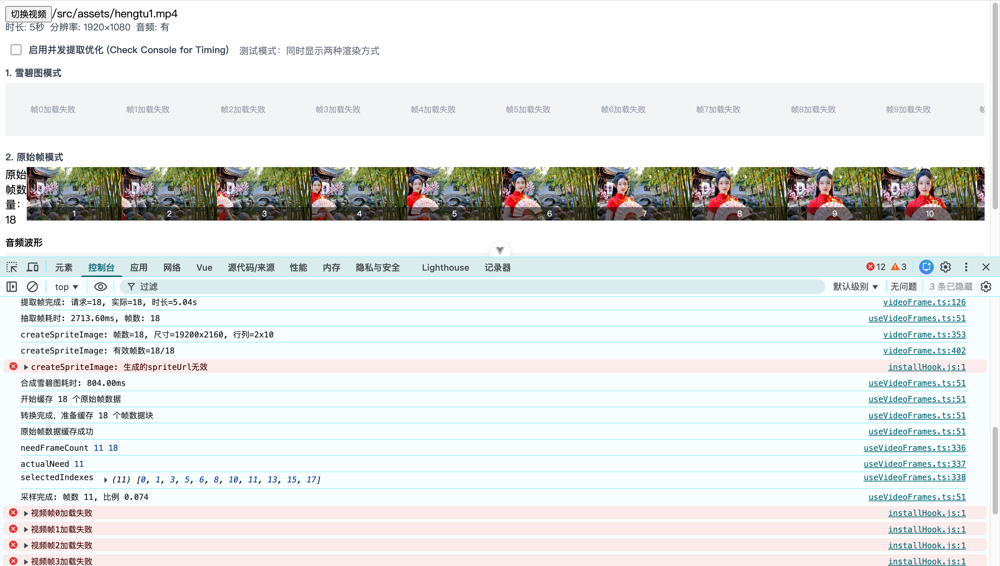

# vue3-element-plus-template

vue3+ts+router+pinia+element-plus+unocss+自动导入API等

## Project Setup

```sh
npm install
```

### Compile and Hot-Reload for Development

```sh
npm run dev
```

### Type-Check, Compile and Minify for Production

```sh
npm run build
```

### Lint with [ESLint](https://eslint.org/)

```sh
npm run lint
```

## 性能对比分析(Concurrent vs Serial)




分析结果：

并发模式没有比串行模式更快（甚至在小规模下更慢），主要原因在于 初始化的固定开销 。

1. 初始化开销 ：我在 getVideoFramesConcurrent 中新增了 并发池初始化耗时 的日志。你可以再次勾选“启用并发提取优化”并观察控制台。你会发现，初始化 6 个 <video> 实例并等待它们 loadedmetadata 可能需要几百毫秒甚至更多，这抵消了并发提取带来的速度提升。
2. 帧数过少 ：当前的测试视频只有 10 秒，提取约 45 帧。在这种小规模任务下，串行模式非常高效，因为它不需要管理多个实例的复杂状态，也没有额外的内存开销。
3. 浏览器缓存 ：对于本地视频，浏览器缓存了文件内容，串行读取（顺序 seek）往往能命中预读缓冲；而并发读取（随机 seek）可能会打断预读，导致效率不如预期。
   结论与建议：

- 对于短视频（如 < 30s） ： 串行模式 往往更快且更稳定，因为启动成本低。
- 对于长视频（如 > 5min）或需要提取几百帧 ： 并发模式 的优势才会体现出来，因为“并行工作”节省的时间足以覆盖“招人（初始化）”的成本。
  现在的代码已经具备了两种模式的切换能力，你可以根据实际视频的长度来动态选择策略，或者直接在 UI 上保留这个开关供调试使用。

现在你可以在控制台看到更详细的时间拆解了：

- 并发池初始化耗时 ：创建 video 标签并加载元数据的耗时。
- 抽取帧耗时 ：包含初始化的总耗时。
- 合成雪碧图耗时 ：将图片拼合的耗时（与模式无关）。

# 穿行并行

- [竖图1]
  开始提取帧 [并发模式]...
  并发池初始化耗时: 10.60ms
  抽取帧耗时: 2638.00ms, 帧数: 45
  合成雪碧图耗时: 5105.20ms
  开始提取帧 [串行模式]...
  抽取帧耗时: 2651.10ms, 帧数: 45
  合成雪碧图耗时: 4982.50ms
- [竖图2]
  开始提取帧 [并发模式]...
  抽取帧耗时: 2683.20ms, 帧数: 45
  合成雪碧图耗时: 4908.00ms
  开始提取帧 [串行模式]...
  抽取帧耗时: 3575.70ms, 帧数: 45
  合成雪碧图耗时: 4797.00ms

- [横图1]
  开始提取帧 [并发模式]...
  抽取帧耗时: 914.40ms, 帧数: 20
  合成雪碧图耗时: 592.10ms
  开始提取帧 [串行模式]...
  抽取帧耗时: 1013.10ms, 帧数: 20
  合成雪碧图耗时: 566.70ms
- [横图2]
  开始提取帧 [并发模式]...
  抽取帧耗时: 406.50ms, 帧数: 18
  合成雪碧图耗时: 815.20ms
  开始提取帧 [串行模式]...
  抽取帧耗时: 784.90ms, 帧数: 18
  合成雪碧图耗时: 857.90ms

  横图确实很快呀...

## 新发现



经过几个小时的多轮测试，5S的横图确实在使用 雪碧图模式的时候，会出现无法生成有效的雪碧图（spriteUrl为data:,）
但是原始帧模式不会出现这个问题。

同时考虑到每次合成雪碧图的耗时也比较长，所以在实际使用中，还是建议使用原始帧模式。
